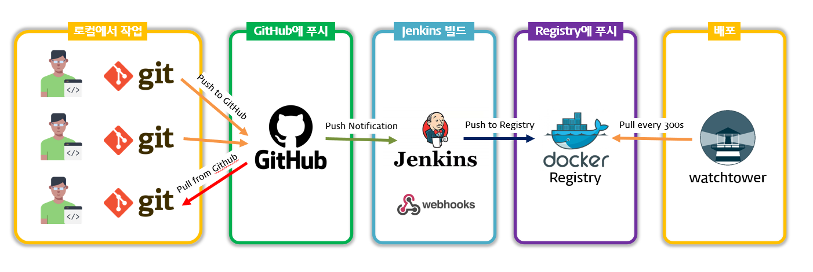

# metaland-infra

metaland 프로젝트를 개발하고 배포하기 위해 사용될 인프라입니다.

* **리버스 프록시**: HTTP/S 요청을 대리하여 처리합니다.
* **접근 제한**: 접근이 제한되어야 할 서버에 대해 Basic Authentication을 적용합니다.
* **HTTPS 인증서 자동화**: Let's Encrypt HTTPS 인증서를 자동으로 발급/갱신합니다.
* **자동 빌드 및 배포**: GitHub에 커밋이 푸시되면 jenkins에서 자동으로 빌드를 수행하고 watchtower에서 배포합니다.

## 개요


## 컨테이너 구성
|컨테이너|역할|포트 사용|
|-|-|-|
|traefik|앞 단에서 모든 HTTP/S 요청을 받으며 지정된 백엔드로 요청을 이어줍니다.|80, 443|
|registry|metaland 프로젝트에서 빌드한 이미지를 저장하는 데 사용되는 Private Docker Registry 입니다.||
|registry-ui|Private Docker Registry를 웹 UI로 표시해주는 프론트엔드입니다.||
|jenkins|GitHub에 커밋이 푸시되면 Webhook을 통해 jenkins가 알림을 받고 Docker 이미지를 빌드, Registry에 푸시합니다.||
|watchtower|주기적으로 Docker 컨테이너를 스캔하고 최신 이미지를 적용합니다.||

## 설치

### 1. 환경변수 설정
환경변수 파일 .env 를 생성하고 아래와 같이 작성합니다.
```
DOMAIN=example.com
LETSENCRYPT_EMAIL=admin@example.com
```
* `DOMAIN` 은 외부에서 접속할 때 사용할 도메인입니다. Let's Encrypt HTTPS 인증서를 발급받을 도메인이기도 합니다.
* `LETSENCRYPT_EMAIL` 은 Let's Encrypt HTTPS 인증서 발급 시 요구되는 항목입니다.

### 2. 사용자 이름 및 비밀번호 설정
인프라 접근을 제한하기 위해 사용자 이름 및 비밀번호를 설정합니다.

`htpasswd` 명령을 사용하여 설정할 수 있습니다. 만약 명령어가 존재하지 않을 시 `sudo apt install apache2-utils` 로 아파치 유틸을 설치한 후 사용해주세요.

```sh
echo $(htpasswd -nB user) | sed -e s/\\$/\\$\\$/g
```
user 부분은 원하는 사용자 이름으로 바꾸고 실행하면 됩니다.

이 명령의 출력을 docker-compose.yml 파일의 `traefik.http.middlewares.admin-auth.basicauth.users=` 뒷 부분에 붙여넣어 주세요.

> 사용자 이름과 비밀번호는 기본 값으로 admin/admin으로 되어 있습니다. 보안을 위해 반드시 변경해주세요.

> 이 프로젝트의 인프라에서는 Basic Authentication을 사용합니다.

### 3. 네트워크 생성
인프라에서 사용할 Docker 브릿지 네트워크를 생성합니다.
```sh
docker network create metaland-net
```

### 4. 인프라 가동
`docker-compose` 명령을 사용하여 인프라를 가동하세요.
```sh
docker-compose up -d
```

`docker-compose ps` 명령으로 모든 컨테이너가 켜졌는지 확인합니다. 만약 문제가 발생하였다면 `docker-compose logs -f --tail 2000` 명령으로 어떤 문제가 발생했는지 확인해주세요.

### 5. 프라이빗 레지스트리 로그인
watchtower가 프라이빗 레지스트리에 접근할 수 있도록 로그인합니다.
```sh
docker login registry.example.com
```
`registry.example.com` 부분은 설정한 도메인으로 바꾼 후 실행합니다. 2. 에서 설정한 사용자 이름과 비밀번호를 입력하여 로그인해주세요.

> `docker login` 명령으로 로그인 시 ~/.docker/config.json 파일에 로그인 정보가 저장됩니다. watchtower가 이 파일을 읽을 수 있도록 docker-compose.yml에서 volume이 매핑되어 있습니다.

## 리버스 프록시 등록

### 1. 네트워크 참여

컨테이너가 인프라 네트워크 `metaland-net` 에 참여하여야 합니다.

**docker-compose.yml**
```yml
services:
  my-backend:
    build: .
    networks: [metaland-net]

# ...

networks:
  metaland-net:
    external: true
```

### 2. traefik 등록

traefik에서 인식할 수 있도록 컨테이너에 label을 추가합니다.

**docker-compose.yml**
```yml
services:
  my-backend:
    build: .
    networks: [metaland-net]
    # Dockerfile에서 포트를 expose 하지 않았다면 아래 라인의 주석을 해제해야 합니다.
    #expose: [8000]
    labels:
      - traefik.enable=true
      - traefik.http.routers.registry.entrypoints=https
      - traefik.http.routers.registry.rule=Host(`registry.${DOMAIN}`)
      - traefik.http.services.registry.loadbalancer.server.port=8000
      # 접근 제한이 필요하다면 아래 주석을 해제하여 Basic Authentication을 적용합니다.
      #- traefik.http.routers.registry.middlewares=admin-auth
```
